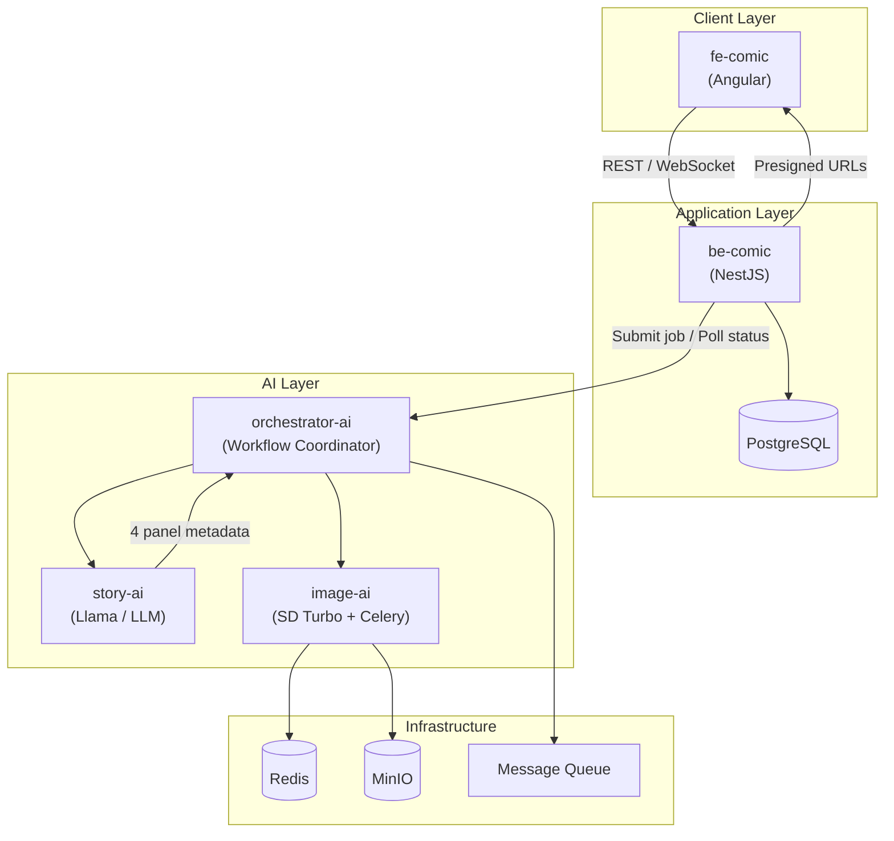

# ComicSystem — Tài liệu Kiến trúc & Đánh giá Pipeline

> **Phiên bản:** 1.1  
> **Ngày cập nhật:** 07/06/2026  
> **Mục đích:** Mô tả kiến trúc hệ thống, đánh giá tính hợp lý của pipeline, và đưa ra khuyến nghị triển khai thực tế.
>
> **Hướng dẫn triển khai microservices:** [MICROSERVICES_GUIDE.md](./MICROSERVICES_GUIDE.md)  
> **Contracts (source of truth):** [contracts/](./contracts/)  
> **Release matrix:** [../deployment/VERSIONS.md](../deployment/VERSIONS.md)

---

## 1. Tổng quan dự án

**ComicSystem** là hệ thống AI sinh truyện tranh tự động từ một đoạn **tóm tắt ngắn** do người dùng nhập. Luồng nghiệp vụ cốt lõi:

1. Người dùng nhập tóm tắt truyện trên web.
2. Hệ thống biến tóm tắt thành **4 đoạn nội dung** phù hợp với **4 khung ảnh** (layout trang truyện 2×2).
3. Mỗi khung được sinh ảnh minh họa kèm lời thoại tiếng Việt.
4. Kết quả hiển thị trên web; người dùng có thể chỉnh sửa (bubble, layout) trước khi xuất bản.

---

## 2. Sơ đồ kiến trúc đề xuất



---

## 3. Vai trò từng service

| Service | Công nghệ | Trách nhiệm chính | Trạng thái hiện tại |
|---------|-----------|-------------------|---------------------|
| **fe-comic** | Angular 21 | UI/UX, nhập tóm tắt, hiển thị trang truyện, editor bubble/layout, auth | Đã có UI editor, auth scaffold |
| **be-comic** | NestJS | API gateway, auth, validation, lưu project/user, quản lý job, không chứa logic AI | Chưa implement (chỉ placeholder) |
| **orchestrator-ai** | Python / Node (tùy chọn) | Điều phối workflow đa bước: summary → story → 4 panel → 4 ảnh → ghép trang | Chưa implement |
| **story-ai** | Python + FastAPI + OpenRouter | Nhận tóm tắt → sinh N đoạn + prompt tiếng Anh + caption tiếng Việt (REST HTTP) | **Chạy được** (`test_run.py`, output JSON thật), chưa khớp field-name với contract gốc |
| **image-ai** | Python + gRPC + Celery + Dreamshaper 8 (SD1.5) | Sinh ảnh từng panel, hậu kỳ Pillow, upload MinIO, cache Redis | **Ổn định, verify bằng ảnh thật nhiều lần** — nhất quán nhân vật (IP-Adapter) đã code xong nhưng tạm khoá (chậm trên Mac 8GB, xem `image-ai/docs/TODO.md`) |
| **deployment** | Docker Compose | **Repo glue** — 1 `docker-compose.yml` compose full stack từ các repo sibling | Skeleton đã có; wire dần khi từng service sẵn sàng |

---

## 4. Luồng request chi tiết (Happy Path)

```
[1] User nhập tóm tắt trên fe-comic
         │
         ▼
[2] POST /api/comics/generate  →  be-comic
    • Validate input (độ dài, rate limit, auth)
    • Tạo job_id, lưu DB status = PENDING
    • Trả về 202 Accepted + job_id  (KHÔNG chờ AI xong)
         │
         ▼
[3] be-comic gọi orchestrator-ai: StartComicGeneration(summary, job_id)
         │
         ▼
[4] orchestrator-ai → story-ai (REST HTTP / FastAPI)
    POST /generate
    Input:  { summary, style?, num_panels: 4 }
    Output: {
      panels: [
        { index: 0, caption_vi, prompt_en, scene, characters[] },
        { index: 1, ... },
        { index: 2, ... },
        { index: 3, ... }
      ],
      character_bible: { ... }   // mô tả nhân vật cố định xuyên suốt
    }
         │
         ▼
[5] orchestrator-ai → image-ai (gRPC, tuần tự hoặc song song có kiểm soát)
    • Panel 0: GenerateImageAsync(prompt, caption, reference=null)
    • Panel 1–3: GenerateImageAsync(..., reference=panel_0_url)  // nhất quán nhân vật
    • Poll GetTaskStatus cho từng task
         │
         ▼
[6] orchestrator-ai ghép 4 ảnh thành trang 2×2 (hoặc gọi image-ai GenerateComicPage)
    • Cập nhật job status = SUCCESS
    • Lưu URLs vào DB qua callback hoặc be-comic poll
         │
         ▼
[7] fe-comic poll GET /api/comics/jobs/:id hoặc nhận WebSocket event
    • Hiển thị trang truyện hoàn chỉnh
    • User chỉnh bubble qua ComicEditorService (client-side)
```

---

## 5. Đánh giá thẳng thắn: Pipeline có đúng không?

### Kết luận ngắn

**Hướng đi tổng thể là ĐÚNG và HỢP LÝ** cho một đồ án/luận văn có yêu cầu thể hiện microservices và AI pipeline. Tuy nhiên, với trạng thái code hiện tại, **độ phức tạp đang vượt xa mức cần thiết cho giai đoạn MVP** — cần ưu tiên theo thứ tự, tránh xây 6 service cùng lúc khi mới có 1 service chạy được.

---

### 5.1 Những điểm làm ĐÚNG

#### Tách lớp rõ ràng (Presentation → Application → AI)
Đây là pattern chuẩn. Angular không nên gọi thẳng AI service — NestJS đóng vai trò **BFF (Backend for Frontend)** xử lý auth, persistence, rate limit là hoàn toàn phù hợp.

#### Tách story-ai và image-ai
LLM (Llama) và Diffusion (Stable Diffusion) có **profile tài nguyên khác nhau**:
- LLM: RAM lớn, inference CPU/GPU nhẹ hơn, latency vài giây
- Diffusion: GPU nặng, mỗi ảnh có thể 30s–3 phút

Tách riêng giúp scale độc lập (ví dụ: 1 GPU worker image-ai, 1 CPU node story-ai).

#### Có orchestrator-ai riêng
Hợp lý khi workflow có **nhiều bước phụ thuộc nhau** (story phải xong trước khi vẽ; panel 1 làm reference cho panel 2–4). Orchestrator giữ **state machine** của job, không nhét logic này vào NestJS.

#### image-ai đã thiết kế bất đồng bộ đúng hướng
gRPC + Celery + Redis queue + MinIO là stack production-grade cho GPU workload. Đây là điểm mạnh nhất của dự án hiện tại.

#### deployment/ — repo glue (docker-compose full stack)
Đúng — với mô hình **1 organization + nhiều repo**, `deployment/` **không phải business service** mà là lớp orchestration:

- Một `docker-compose.yml` build từ `../fe-comic`, `../be-comic`, `../orchestrator-ai`, …
- Chạy infra dùng chung: PostgreSQL, Redis, MinIO
- Định nghĩa network nội bộ (`comic-internal`) — AI service **không expose** ra internet
- Mỗi repo vẫn có thể dev độc lập (docker-compose riêng hoặc `ng serve` / `python src/server.py`)

**Yêu cầu layout máy dev / CI:**

```
ComicSystem/
├── deployment/       ← docker compose up
├── fe-comic/
├── be-comic/
├── orchestrator-ai/
├── story-ai/
├── image-ai/
└── documents/
```

---

### 5.2 Những điểm cần LƯU Ý / SAI nếu không xử lý

#### Rủi ro #1 — Request đồng bộ end-to-end (NGHIÊM TRỌNG)

Sinh 4 ảnh trên Mac hiện tại mất **~5-7 phút** (đo thật: Dreamshaper 8/SD1.5, 20 steps, ~80-100s/panel
khi RAM máy còn rảnh — có thể chậm hơn nhiều, tới hàng chục phút, nếu máy 8GB thiếu RAM lúc chạy, xem
`image-ai/docs/TODO.md`). Nếu Angular → NestJS → Orchestrator giữ HTTP connection chờ kết quả:

- Timeout ở mọi tầng (browser, nginx, NestJS)
- UX tệ, server bị chiếm connection
- Không recover được khi client refresh

**Bắt buộc:** Mô hình **async job** từ tầng be-comic trở xuống. Client chỉ nhận `job_id`, poll hoặc WebSocket.

#### Rủi ro #2 — orchestrator-ai có thể thành "pass-through vô nghĩa"

Nếu orchestrator chỉ forward request story-ai rồi forward image-ai mà không có:
- State machine (PENDING → STORY_DONE → IMAGE_1 → ... → COMPLETE)
- Retry / compensation khi 1 panel fail
- Correlation ID xuyên suốt
- Timeout per step

→ Lúc đầu có thể **gộp orchestrator vào be-comic** (NestJS gọi thẳng gRPC), tách ra sau khi workflow phức tạp hơn.

#### Rủi ro #3 — Nhất quán nhân vật giữa 4 khung (code xong, tạm khoá)

Đây là **core value** của comic, không phải nice-to-have.

- **image-ai**: đã tích hợp IP-Adapter (`reference_image_url` → tải ảnh panel trước → điều kiện hoá
  sinh ảnh) — **nhưng đang tắt** (`IMAGE_AI_IP_ADAPTER_ENABLED=false`) vì đo thật trên Mac 8GB chậm
  gấp ~10 lần (mỗi panel từ ~90s lên ~745s, không khả thi cho demo). Bật lại khi có GPU cloud, không
  cần sửa code.
- **story-ai**: chưa có `character_bible`/`character_ids` — output hiện tại (`panel_number`,
  `image_prompt`, `speaker`, `dialogue`) không có khái niệm nhân vật cố định xuyên suốt. Việc map
  field + thiết kế character bible đang để orchestrator-ai tự xử lý (không giao thêm việc cho story-ai).
- **orchestrator-ai**: đã có sẵn logic truyền `reference_image_url=panel_0_url` cho panel 2–4
  (`comic_job.py`), chỉ cần image-ai bật `IP_ADAPTER_ENABLED=true` là chạy được ngay, không cần sửa gì thêm.

Không giải quyết được điểm này thì 4 khung sẽ là 4 cảnh không liên quan — sản phẩm mất ý nghĩa. Hiện
tạm chấp nhận để demo E2E chạy được trước, bật lại đúng lúc chuyển sang GPU cloud.

#### Rủi ro #4 — Contract giữa services chưa rõ

story-ai dùng **FastAPI (REST HTTP)** thay gRPC — cần định nghĩa OpenAPI contract sớm (`story_generation.openapi.yaml` trong `documents/contracts/`):

```json
// POST /generate  →  200 OK
{
  "panels": [
    {
      "index": 0,
      "caption_vi": "Lời thoại hiển thị trên bubble",
      "prompt_en": "Prompt cho diffusion model",
      "scene_description": "Mô tả cảnh",
      "character_ids": ["char_001"]
    }
  ],
  "characters": {
    "char_001": { "name": "...", "description": "..." }
  }
}
```

OpenAPI contract là **hợp đồng** giữa `orchestrator-ai` (client) và `story-ai` (server) — nên ưu tiên trước khi code logic.

#### Rủi ro #5 — Multi-repo (organization + repo riêng từng service)

Thiết kế này **hợp lý cho microservices** — không cần gộp mono-repo. Điểm cần chủ ý:

- Đồng bộ version proto giữa các repo
- CI/CD: mỗi repo build/test riêng; `deployment` repo trigger full stack khi release tag
- Pin version từng service trong `deployment/VERSIONS.md` (hoặc image tag)

**Khuyến nghị:** Repo `documents/` hoặc `comic-contracts/` chứa proto dùng chung; `deployment/docker-compose.yml` là single entry point chạy full stack.

#### Rủi ro #6 — Trùng lặp trách nhiệm caption/bubble

- image-ai: Pillow chèn caption cố định ở đáy ảnh
- fe-comic: ComicEditorService quản lý bubble động (vị trí, font, tail)

Cần quyết định rõ:
- **Option A (khuyến nghị cho MVP):** AI chỉ sinh ảnh thuần (không chèn chữ); FE overlay bubble từ `caption_vi` của story-ai. User edit thoải mái.
- **Option B:** AI burn-in caption; FE chỉ preview, edit = regenerate panel.

Option A linh hoạt hơn và khớp với editor Angular đã có.

---

## 6. Góp ý kiến trúc từ góc nhìn Senior Backend (10 năm)

### 6.1 Kiến trúc đề xuất theo giai đoạn

Không nên build full 6-service ngay. Lộ trình thực tế:

| Giai đoạn | Phạm vi | Mục tiêu |
|-----------|---------|----------|
| **Phase 0** (hiện tại) | image-ai standalone E2E | 1 panel, gRPC, cache, MinIO — **đã xong** |
| **Phase 1** | + story-ai MVP + script JSON cứng | Tóm tắt → 4 panel metadata (chưa cần orchestrator) |
| **Phase 2** | + be-comic + orchestrator đơn giản | Async job API, luồng end-to-end qua Postman |
| **Phase 3** | + fe-comic integration | UI submit + poll + hiển thị |
| **Phase 4** | Character consistency + 2×2 page | IP-Adapter, GenerateComicPage |
| **Phase 5** | deployment production | GPU cloud, monitoring, CI/CD |

### 6.2 NestJS (be-comic) nên làm gì — và KHÔNG làm gì

**Nên:**
- JWT auth, user/project CRUD
- PostgreSQL: users, comics, generation_jobs, panel_results
- `POST /comics/generate` → enqueue job
- `GET /comics/jobs/:id` → trả status + URLs
- Rate limiting, input sanitization
- Webhook/callback từ orchestrator cập nhật DB

**Không nên:**
- Gọi Llama trực tiếp
- Giữ connection chờ GPU
- Chứa logic prompt engineering
- Upload ảnh binary qua NestJS (dùng MinIO presigned URL)

### 6.3 orchestrator-ai — trách nhiệm cốt lõi

Orchestrator là **Saga coordinator**, không phải API gateway:

```
States:
  CREATED → STORY_GENERATING → STORY_READY
          → IMAGE_PANEL_0 → IMAGE_PANEL_1 → IMAGE_PANEL_2 → IMAGE_PANEL_3
          → COMPOSING → SUCCESS | FAILED

Events:
  on_story_fail  → retry 2x → mark FAILED, notify be-comic
  on_image_fail  → retry panel only (không regenerate story)
  on_timeout     → cancel Celery tasks, cleanup VRAM
```

Công nghệ gợi ý: Python (cùng ecosystem AI) + Redis làm workflow state + gRPC client tới story/image.

### 6.4 Giao tiếp giữa services

| Tuyến | Giao thức | Lý do |
|-------|-----------|-------|
| fe-comic ↔ be-comic | REST + WebSocket/SSE | Chuẩn web, dễ debug |
| be-comic ↔ orchestrator | gRPC hoặc REST | Ít call, cần typed contract |
| orchestrator ↔ story-ai | **REST HTTP (FastAPI)** | Dễ implement, debug; latency LLM vài giây nên HTTP đủ |
| orchestrator ↔ image-ai | gRPC (đã có) | Async task pattern sẵn |
| Tất cả ↔ Redis/MinIO | Client SDK | Cache, queue, storage |

**Không dùng REST sync** cho image-ai — đã có gRPC async task pattern, giữ nguyên.  
**story-ai dùng FastAPI** — gọi đồng bộ từ orchestrator (LLM vài giây, không cần async task queue riêng).

### 6.5 Database schema tối thiểu (be-comic)

```sql
-- generation_jobs
id, user_id, summary_text, status, created_at, updated_at, error_message

-- panel_results  
id, job_id, panel_index, caption_vi, prompt_en, image_url, seed, status

-- comics (project người dùng lưu)
id, user_id, title, editor_state_json, created_at
```

### 6.6 Observability (thường bị bỏ quên trong đồ án)

- **Correlation ID** (`X-Request-Id`) từ FE → BE → Orchestrator → AI services
- Structured logging (JSON)
- Metrics: job duration, panel success rate, cache hit rate (image-ai đã có Prometheus hooks)
- Health checks: `/health` mỗi service

### 6.7 Deployment — `deployment/docker-compose.yml`

Repo `deployment` là **single entry point** cho toàn organization:

```bash
cd deployment
docker compose up --build
```

**Services trong compose:**

| Service | Build context | Public? | Ghi chú |
|---------|---------------|---------|---------|
| `fe-comic` | `../fe-comic` | ✅ port 3000 | nginx production build |
| `be-comic` | `../be-comic` | ✅ port 8000 | Chỉ API gateway ra ngoài |
| `orchestrator-ai` | `../orchestrator-ai` | ❌ internal | BE gọi qua `comic-internal` network |
| `story-ai` | `../story-ai` | ❌ internal | gRPC, Llama |
| `image-ai-grpc` | `../image-ai` | ❌ internal | gRPC server |
| `image-ai-worker` | `../image-ai` | ❌ internal | Celery GPU worker |
| `postgres`, `redis`, `minio` | image hub | ❌ / hạn chế | Shared infra |

**Dev vs Full stack:**

| Mục đích | Cách chạy |
|----------|-----------|
| Dev UI hot-reload | `cd fe-comic && npm start` |
| Dev image-ai | `cd image-ai && docker compose up redis minio` + worker local |
| Demo / deploy full | `cd deployment && docker compose up --build` |
| Production GPU tách | Chỉ deploy `image-ai-*` lên GPU cloud; compose CPU stack trên VPS, trỏ `IMAGE_AI_GRPC_URL` qua VPN/tunnel |

```
┌─────────────────────────────────────────────┐
│  deployment/docker-compose (VPS / Cloud CPU)  │
│  • fe-comic, be-comic (public ports)        │
│  • orchestrator-ai, story-ai (internal)     │
│  • postgres, redis, minio                   │
└──────────────────────┬──────────────────────┘
                       │ gRPC (comic-internal)
┌──────────────────────▼──────────────────────┐
│  image-ai-grpc + image-ai-worker (GPU node) │
│  Có thể cùng compose (dev) hoặc tách (prod) │
└─────────────────────────────────────────────┘
```

GPU worker **không nên** scale cùng pod với NestJS — billing và resource profile khác nhau; production có thể tách `image-ai-worker` sang GPU cloud, giữ URL trong env của `orchestrator-ai`.

---

## 7. Ma trận đánh giá tổng hợp

| Tiêu chí | Điểm (1–5) | Nhận xét |
|----------|------------|----------|
| Tách service hợp lý | 4/5 | Đúng hướng; hơi nhiều tầng cho MVP |
| Khả năng scale | 4/5 | image-ai async tốt; cần async toàn pipeline |
| Độ phức tạp vận hành | 2/5 | 6 repo, nhiều infra — cao cho solo/small team |
| Tính khả thi đồ án | 4/5 | image-ai mạnh; tập trung story + orchestrator là đủ demo |
| UX end-user | 3/5 | Phụ thuộc async UI + character consistency |
| Bảo mật cơ bản | 3/5 | FE có auth scaffold; BE chưa implement |

---

## 8. Checklist hành động ưu tiên

### Ưu tiên cao (tuần tới)
- [ ] Hoàn thiện `story_generation.proto` với output 4 panel structured
- [ ] story-ai MVP: Llama prompt → JSON 4 panels (có thể mock trước)
- [ ] be-comic skeleton: `POST /generate`, `GET /jobs/:id`, PostgreSQL
- [ ] orchestrator MVP: gọi story-ai → loop 4 lần image-ai → aggregate
- [ ] Async contract: mọi API trả job_id, không block

### Ưu tiên trung bình
- [ ] fe-comic: service gọi BE, polling UI với progress (1/4, 2/4...)
- [x] Character consistency: IP-Adapter panel 1 → 2,3,4 — **code xong trong image-ai, tạm khoá** (chậm
    trên Mac 8GB), bật lại khi có GPU cloud
- [ ] GenerateComicPage API trong image-ai (ghép 2×2)
- [ ] Bỏ burn-in caption ở image-ai nếu dùng FE bubble overlay

### Ưu tiên thấp (sau MVP)
- [ ] WebSocket thay polling
- [ ] CI/CD: mỗi repo build riêng + `deployment` trigger full stack on tag
- [ ] `deployment/VERSIONS.md` — compatibility matrix giữa các repo
- [ ] Temporal/Celery workflow cho orchestrator (thay state manual)

---

## 9. Câu trả lời trực tiếp cho câu hỏi "Pipeline có đúng không?"

| Câu hỏi | Trả lời |
|---------|---------|
| FE → BE → Orchestrator → Story → Image → Response có hợp lý? | **Có**, đây là pipeline chuẩn cho AI multi-step |
| Có quá nhiều tầng không? | **Hơi nhiều cho MVP**, nhưng **hợp lý cho luận văn** thể hiện system design |
| NestJS có nên gọi thẳng image-ai? | **Không** — nên qua orchestrator hoặc queue |
| Có nên bỏ orchestrator? | **Không nên bỏ** nếu muốn demo workflow; có thể **delay** implement đến Phase 2 |
| Điểm yếu lớn nhất hiện tại? | **be-comic, orchestrator-ai đều trống** — story-ai đã chạy được (FastAPI) nhưng schema chưa khớp contract; image-ai đi trước xa nhất |
| Điểm mạnh lớn nhất? | **image-ai production-ready pattern** (gRPC + Celery + cache + MinIO), đã verify bằng ảnh thật nhiều lần, nhất quán nhân vật đã sẵn code |

---

## 10. Tài liệu tham chiếu trong repo

| Đường dẫn | Nội dung |
|-----------|----------|
| `image-ai/README.md` | Hướng dẫn chạy image-ai |
| `image-ai/docs/TODO.md` | Roadmap image-ai (Phase A/B/C) |
| `image-ai/proto/image_generation.proto` | gRPC contract image service |
| `documents/contracts/story_generation.openapi.yaml` | REST contract story-ai (FastAPI) — thay thế proto |
| `deployment/docker-compose.yml` | Full stack compose — glue tất cả repo sibling |
| `documents/MICROSERVICES_GUIDE.md` | Hướng dẫn microservices chuẩn + lộ trình implement |
| `documents/contracts/` | Proto + OpenAPI — source of truth giữa các service |
| `deployment/VERSIONS.md` | Compatibility matrix khi release |
| `documents/scripts/sync-contracts.sh` | Copy proto/OpenAPI sang từng service repo |
| `fe-comic/src/app/features/comic-editor/` | UI editor truyện |

---

## 11. Lời kết

Pipeline bạn thiết kế **đúng tư duy kiến trúc microservices cho AI system** — không phải kiểu "monolith nhét hết AI vào NestJS". Điểm then chốt không phải là thêm/bớt service, mà là:

1. **Async job end-to-end** — không ai chờ ai qua HTTP sync.
2. **Structured output từ story-ai** — không dump plain text cho image-ai đoán.
3. **Character consistency** — không thì không phải comic mà là 4 ảnh rời.
4. **Implement theo phase** — image-ai đã tốt; giờ cần story-ai + orchestrator + be-comic để nối được pipeline, không mở rộng thêm service mới.

Với một đồ án/luận văn, kiến trúc này **đủ depth để viết Chương Kiến trúc Hệ thống** và **đủ thực tế nếu triển khai theo roadmap Phase 0→5** ở trên.

---

*Tài liệu này nên được cập nhật khi hoàn thành từng phase. Người maintain: team ComicSystem.*
