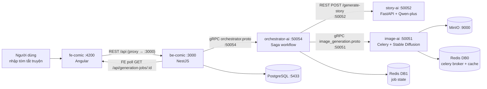

# Hướng dẫn chạy toàn bộ pipeline: FE → BE → Orchestrator → Story-AI → Image-AI → FE

Ngày: 2026-07-15 (viết lại theo hướng "runbook" từ bản audit 2026-07-14)

Mục tiêu file này: cầm tay chỉ việc **bật đúng thứ tự 5 service**, nối chúng
thành **1 hệ thống chạy thật**, gọi API từ FE, và nhìn thấy kết quả (ảnh +
caption) hiển thị lên FE — không dừng ở mức audit/nhận xét nữa.

Toàn bộ lệnh, field, port dưới đây đã đọc lại trực tiếp từ code (không suy
đoán từ tài liệu cũ):
`fe-comic`, `be-comic`, `orchestrator-ai`, `story-ai`, `image-ai`.

---

## 0. Sơ đồ tổng thể (nối 5 service thành 1 hệ thống)



**Nguyên tắc thứ tự khởi động:** service nào **bị gọi** thì bật **trước**,
service nào **đi gọi** thì bật **sau**. Vì vậy thứ tự đúng là:

```
image-ai  →  story-ai  →  orchestrator-ai  →  be-comic (+ seed DB)  →  fe-comic
(đáy pipeline)                                                        (người dùng bấm nút)
```

Bật ngược thứ tự này vẫn có thể chạy được (các service tự retry/poll), nhưng
sẽ thấy log warning "không kết nối được" trong lúc chờ — bật đúng thứ tự để
tránh nhiễu khi debug.

---

## 1. Chuẩn bị môi trường (làm 1 lần)

| Công cụ | Dùng cho |
|---|---|
| Python 3.10+ | `story-ai`, `orchestrator-ai`, `image-ai` |
| Node.js 18+ | `be-comic`, `fe-comic` |
| Docker Desktop | Postgres (be-comic), Redis + MinIO (image-ai) |
| GPU khuyến nghị (không bắt buộc) | `image-ai` Celery worker — chạy CPU vẫn được nhưng chậm |

Mỗi service có `.env` riêng — kiểm tra tồn tại trước khi chạy:

```bash
ls image-ai/.env story-ai/.env orchestrator-ai/.env be-comic/.env
```

Nếu thiếu, copy từ `.env.example` tương ứng trong mỗi thư mục rồi điền giá
trị thật (đặc biệt `story-ai/.env` cần `API_KEY` thật của OpenRouter/DashScope
để sinh truyện, không dùng key giả).

---

## BƯỚC 1 — `image-ai` (tầng đáy, bật trước tiên)

```bash
cd image-ai
docker compose up -d redis minio      # chỉ 2 service này chạy qua Docker (api-server/celery-worker đang comment sẵn)
./scripts/generate_proto.sh            # sinh code gRPC vào src/service/generated/

# Terminal 1: gRPC + health server
python src/server.py                   # gRPC :50051, HTTP health :8000

# Terminal 2: Celery worker (nạp model Stable Diffusion — bắt buộc để sinh ảnh thật)
cd image-ai/src
celery -A worker.celery_app worker --loglevel=info --concurrency=1 --pool=solo
```

- Lần đầu chạy, worker tự tải model Dreamshaper 8 từ HuggingFace (~2-4GB, cần
  internet), có thể mất vài phút.
- **Verify bước này xong:**
  ```bash
  curl http://localhost:8000/healthz
  ```
  Phải thấy `"pipeline_ready": true` (nghĩa là Celery worker đã nạp xong
  model) và `"minio"` / `"redis"` đều `"healthy": true`. Nếu
  `pipeline_ready: false`, worker chưa load xong — đợi thêm rồi curl lại.

---

## BƯỚC 2 — `story-ai`

```bash
cd story-ai
pip install -r requirements.txt
python src/server.py                   # HTTP :50052
```

- Server đọc biến `PORT` trong `.env` (mặc định `50052`) — **không đọc**
  `GRPC_PORT` dù file `.env` có khai báo biến này (`story-ai/src/config.py`
  chỉ có `Config.PORT`). Không cần sửa gì để chạy đúng, chỉ cần biết port
  thật luôn là giá trị của `PORT`.
- **Verify:**
  ```bash
  curl http://localhost:50052/health
  ```
  Trả về `200` nghĩa là FastAPI + kết nối LLM (Qwen-plus qua OpenRouter/
  DashScope) sẵn sàng nhận request từ orchestrator.

---

## BƯỚC 3 — `orchestrator-ai` (bộ não nối story-ai + image-ai)

```bash
cd orchestrator-ai
pip install -r requirements.txt        # đã có pydantic-settings, không cần cài thêm gì thủ công

# Cần Redis DB1 cho lưu trạng thái job — dùng chung container Redis vừa bật ở BƯỚC 1
redis-cli -h localhost -p 6379 ping    # phải trả PONG

python -m src.server                   # gRPC :50054
```

- `orchestrator-ai/.env` đã trỏ sẵn đúng địa chỉ 2 service kia:
  `ORCHESTRATOR_STORY_AI_API_URL=http://localhost:50052`,
  `ORCHESTRATOR_IMAGE_AI_GRPC_TARGET=localhost:50051` — không cần sửa nếu
  BƯỚC 1–2 đã chạy đúng port mặc định.
- **Verify:** log khởi động không có warning kiểu "story-ai/image-ai không
  phản hồi". Nếu có, quay lại BƯỚC 1–2 kiểm tra health trước.
- Không có `docker-compose.yml`/`Dockerfile` dùng được cho service này (cả 2
  file đang rỗng 0 byte) — bắt buộc chạy bằng lệnh Python thủ công như trên.

---

## BƯỚC 4 — `be-comic` (+ seed dữ liệu — bắt buộc trên DB sạch)

```bash
cd be-comic
docker compose up -d                   # Postgres :5433
npm install
npm run migration:run                  # tạo schema — KHÔNG seed sẵn user/project
```

### ⚠️ Seed bắt buộc trước khi test — nếu bỏ qua, FE sẽ luôn nhận lỗi 500

`fe-comic` đang hardcode sẵn `projectId` để test
(`comic-editor-page.ts:32`, `DEV_PROJECT_ID = '8118902a-36b6-4afd-a5c1-1e64acaeeefc'`).
Bảng `COMIC_GENERATION_JOB.project_id` có **FK CASCADE thật** tới
`COMIC_PROJECT` — nếu project này chưa có trong DB, request tạo job sẽ vỡ FK
và be-comic trả `500`. Không có migration nào tự seed 2 row này, nên **trên
DB sạch phải chạy tay lệnh dưới đây một lần:**

```bash
docker exec -it be-comic-postgres psql -U admin -d comic_db -c "
INSERT INTO \"COMIC_USER\" (id, email, password_hash)
VALUES ('11111111-1111-1111-1111-111111111111', 'dev@local.test', 'dev-only-not-a-real-hash')
ON CONFLICT (id) DO NOTHING;

INSERT INTO \"COMIC_PROJECT\" (id, user_id, title, raw_prompt)
VALUES ('8118902a-36b6-4afd-a5c1-1e64acaeeefc', '11111111-1111-1111-1111-111111111111', 'Dev Project', 'seed cho test tích hợp FE-BE')
ON CONFLICT (id) DO NOTHING;
"
```

(Bỏ qua bước này nếu DB đã có sẵn 2 row trên từ lần chạy trước.)

```bash
npm run start:dev                      # HTTP :3000
```

- **Verify:**
  ```bash
  curl -X POST http://localhost:3000/api/generation-jobs \
    -H "Content-Type: application/json" \
    -d '{"projectId":"8118902a-36b6-4afd-a5c1-1e64acaeeefc","summary":"test seed","style":"storybook","numPanels":2}'
  ```
  Phải trả `202` kèm `jobId`. Nếu trả `500 "Active pipeline AI error"`, nghĩa
  là BE gọi được nhưng orchestrator/story-ai/image-ai chưa sẵn sàng — quay
  lại BƯỚC 1–3.

---

## BƯỚC 5 — `fe-comic` (hiển thị kết quả cho người dùng)

```bash
cd fe-comic
npm install
npm start                              # :4200, proxy /api → :3000 qua proxy.conf.json
```

Mở `http://localhost:4200`, nhập tóm tắt truyện, bấm **"Generate Comic"**.

---

## BƯỚC 6 — Toàn bộ chuỗi thật sẽ chạy như sau

```
FE nhập tóm tắt
  → POST /api/generation-jobs (be-comic ghi COMIC_GENERATION_JOB, status=RUNNING)
    → gRPC StartComicGeneration (orchestrator nhận, trả về ngay, chạy nền bằng thread)
      → REST POST /generate-story (story-ai, Qwen-plus sinh N panel JSON thật)
        → gRPC GenerateImageAsync × N panel (image-ai, Stable Diffusion; panel 0 làm ảnh tham chiếu)
          → poll GetTaskStatus tới khi SUCCESS/FAILED cho từng panel
  → FE poll GET /api/generation-jobs/:id mỗi vài giây
    → be-comic poll gRPC GetComicJobStatus (orchestrator, đọc Redis DB1)
      → khi status=SUCCESS: be-comic ghi COMIC_FRAME vào Postgres rồi trả COMPLETED cho FE
  → FE hiển thị đủ ảnh + caption tiếng Việt thật (không phải placeholder)
```

**Thời gian dự kiến:** máy không có GPU rời, 1 job 4 panel mất **3–5 phút**
(Dreamshaper 8/SD1.5 chạy CPU/LCM). Lần chạy Celery worker đầu tiên cộng thêm
vài phút tải model từ HuggingFace.

---

## 2. Checklist verify end-to-end (chạy tay theo đúng thứ tự)

- [ ] `curl http://localhost:8000/healthz` (image-ai) → `pipeline_ready: true`
- [ ] `curl http://localhost:50052/health` (story-ai) → `200 OK`
- [ ] orchestrator log không còn warning "story-ai/image-ai không phản hồi"
- [ ] `psql` thấy đủ row user `11111111-...` + project `8118902a-...`
- [ ] `POST http://localhost:3000/api/generation-jobs` trả `202` + `jobId`
      (không phải `500 "Active pipeline AI error"`)
- [ ] `GET http://localhost:3000/api/generation-jobs/:id` sau vài phút trả
      `status: COMPLETED` kèm `panels[]` có `imageUrl` thật
- [ ] FE (`http://localhost:4200`) hiển thị đủ ảnh + caption tiếng Việt

---

## 3. Field mapping từng chặng (để debug khi 1 bước không khớp)

**be-comic → orchestrator-ai** (`StartComicGeneration`,
`generation-jobs.service.ts:104-113`):

| be-comic gửi | orchestrator nhận |
|---|---|
| `jobId`, `userId`, `summary`, `style` (default `'storybook'`), `numPanels` (default `4`), `requestId` | field cùng tên trong `orchestrator.proto` |

**orchestrator-ai → story-ai** (`StoryClient.generate_story`,
`orchestrator-ai/src/clients/story_client.py:59-81`) — orchestrator tự map
field, story-ai không cần đổi tên:

| story-ai trả về (`panels[]`) | orchestrator map sang |
|---|---|
| `panel_number` | `index = panel_number - 1` (rồi sort + gán lại theo vị trí thực) |
| `dialogue` | `caption_vi` |
| `image_prompt` | `prompt_en` |
| `panel_type` | `scene_description` |
| `speaker` | `speaker` |
| `is_fallback` | chặn job nếu `true` trừ khi `ORCHESTRATOR_STORY_ALLOW_FALLBACK=true` |

**orchestrator-ai → image-ai** (`ImageAiClient.generate_panel`,
`orchestrator-ai/src/clients/image_client.py:36-58`):

- Panel đầu tiên (`index == 0`): `reference_image_url=""`.
- Tất cả panel sau dùng `reference_image_url = <minio_url của panel 0>`
  (không phải panel liền trước) — đúng thiết kế "1 nhân vật gốc tham chiếu
  xuyên suốt", nhưng IP-Adapter đang tắt
  (`IMAGE_AI_IP_ADAPTER_ENABLED=false`) nên field này gửi đi nhưng image-ai
  chưa dùng tới.
- Poll `GetTaskStatus` mỗi `ORCHESTRATOR_IMAGE_POLL_INTERVAL_SEC` (2s), tối
  đa `ORCHESTRATOR_IMAGE_POLL_MAX_ATTEMPTS` (360 lần ≈ 12 phút/panel).

**orchestrator-ai → be-comic** (poll `GetComicJobStatus`,
`generation-jobs.service.ts:150-180`):

| status enum orchestrator | be-comic map |
|---|---|
| `6` (`COMIC_JOB_SUCCESS`) | `COMPLETED` + gọi `framesService.saveFromPanels()` ghi Postgres |
| `7` (`COMIC_JOB_FAILED`) | `FAILED` + lưu `errorMessage` |
| `8` (`COMIC_JOB_CANCELLED`) | `CANCELLED` |

`FramesService.saveFromPanels` (`frames.service.ts:34-50`) ghi mỗi panel vào
bảng `COMIC_FRAME` với `image_prompt = p.promptEn`, `caption_vi = p.captionVi`,
`image_url` = chuyển presigned URL của MinIO thành object key (bỏ phần
domain/query, chỉ giữ path) — vì FE tự build lại URL hiển thị qua endpoint
riêng, không lưu presigned URL có hạn dùng (TTL) trực tiếp vào DB.

---

## 4. Các vấn đề đã biết (không chặn chạy theo hướng dẫn trên, nhưng nên sửa)

| # | Vấn đề | Mức độ | Ghi chú |
|---|---|---|---|
| 1 | `be-comic` không có migration seed user/project mặc định | 🔴 Chặn trên DB sạch nếu bỏ qua bước seed ở BƯỚC 4 | Đã có lệnh SQL vá tay ở trên; nên chuyển thành migration TypeORM thật |
| 2 | `ProjectsController` không đọc `user_id` từ JWT, luôn dùng `DEFAULT_USER_ID` hardcode dù `POST /projects` không có auth guard | 🟡 Không chặn demo, nhưng auth "giả" | Nên sửa trước khi cho nhiều user thật dùng chung hệ thống |
| 3 | `image-ai/Dockerfile` — `CMD ["python", "-m", "src.server"]` không khớp import tương đối trong `server.py` (không có `src/__init__.py`) | 🟡 Chỉ lộ khi Docker hoá image-ai | Chạy `python src/server.py` local (theo hướng dẫn BƯỚC 1) không bị ảnh hưởng |
| 4 | `story-ai/.env` có biến `GRPC_PORT` nhưng code chỉ đọc `PORT` | 🟢 Dọn dẹp, không chặn | Đổi tên biến trong `.env` thành `PORT` cho khỏi nhầm |
| 5 | `orchestrator-ai/docker-compose.yml` + `Dockerfile` vẫn rỗng 0 byte | 🟢 Không chặn chạy tay | Chỉ cần nếu muốn Docker hoá orchestrator |
| 6 | `image-ai/docker-compose.yml` — `api-server`/`celery-worker` vẫn đang comment | 🟢 Không chặn — BƯỚC 1 đã hướng dẫn chạy 2 service này bằng lệnh Python/Celery thủ công | Uncomment được sau khi sửa vấn đề #3 |
| 7 | IP-Adapter (`IMAGE_AI_IP_ADAPTER_ENABLED=false`) tắt mặc định | 🟢 Quyết định có chủ đích (máy 8GB RAM chạy chậm ~10 lần khi bật) | Không phải bug |
